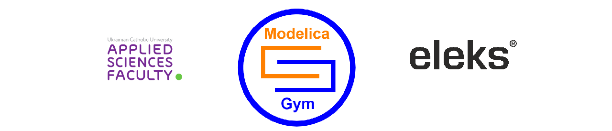

# ModelicaGym: Applying Reinforcement Learning to Modelica Models

This *ModelicaGym* toolbox was developed to employ Reinforcement Learning (RL) for solving optimization and control tasks in Modelica models. The developed tool allows connecting models using Functional Mock-up Interface (FMI) to OpenAI Gym toolkit in order to exploit Modelica equation-based modelling and co-simulation together with RL algorithms as a functionality of the tools correspondingly. Thus, *ModelicaGym* facilitates fast and convenient development of RL algorithms and their comparison when solving optimal control problem for Modelica dynamic models. 

Inheritance structure of the *ModelicaGym* toolbox classes and the implemented methods are discussed in details in examples. The toolbox functionality validation is performed on the Cart-Pole balancing problem. This includes physical system model description and it's integration in the toolbox, experiments on selection and influence of the model parameters (i.e. force magnitude, Cart-pole mass ratio, reward ratio, and simulation time step) on the learning process of Q-learning algorithm supported with discussion of the simulation results. 

### Paper
ArXiv preprint version can be found [here](https://arxiv.org/abs/1909.08604).

Repository contains:
* `modelicagym.environments` package for integration of FMU as an environment to OpenAI Gym.
FMU is a functional model unit exported from one of the main Modelica tools, e.g. Dymola(proprietary) or JModelica(open source).
Currently only FMU's exported in co-simulation mode are supported.
* `gymalgs.rl` package for Reinforcement Learning algorithms compatible to OpenAI Gym environments.

## Instalation
Full instalation guide is available [here](https://github.com/ucuapps/modelicagym/blob/master/docs/install.md).

You can test working environment by running 
[./test_setup.py](https://github.com/ucuapps/modelicagym/blob/master/test/setup_test.py) script.

You can install package itself by running `pip install git+https://github.com/ucuapps/modelicagym.git` (or `pip3 install git+https://github.com/ucuapps/modelicagym.git` if you have both python versions installed).

## Examples
Examples of usage of both packages can be found in examples folder.
* [Tutorial](https://github.com/OlehLuk/modelicagym/blob/master/docs/fmu_integration_tutorial.md) explains how to integrate FMU using this toolbox in a step-wise manner. CartPole problem is considered as an illustrative example for the tutorial. Code from [cart_pole_env.py](https://github.com/OlehLuk/modelicagym/blob/master/examples/cart_pole_env.py) is referenced and described in details.

* [cart_pole_env.py](https://github.com/ucuapps/modelicagym/blob/master/examples/cart_pole_env.py)
is an example how a specific FMU can be integrated to an OpenAI Gym as an environment. Classic cart-pole environment is considered.
Corresponding FMU's can be found in the resources folder.

* [cart_pole_q_learner.py](https://github.com/ucuapps/modelicagym/blob/master/examples/cart_pole_q_learner.py) 
is an example of Q-learning algorithm application. Agent is trained on the Cart-pole environment simulated with an FMU. Its' integration is described in previous example.

* Running examples is expected without modelicagym package installation.
To run cart_pole_q_learner.py one just has to clone the repo.
The advised way to run examples is with PyCharm IDE. It automatically adds project root to the PYTHONPATH.

If one wants to run example from the command line, they should update PYTHONPATH with project root:
```bash
:<work_dir>$ git clone https://github.com/ucuapps/modelicagym.git
:<work_dir>$ export PYTHONPATH=$PYTHONPATH:<work_dir>/modelicagym
:<work_dir>$ cd modelicagym/examples
:<work_dir>/modelicagym/examples $ python3 cart_pole_q_learner.py
```
